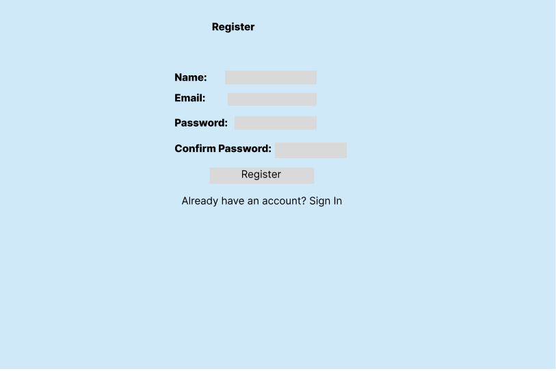
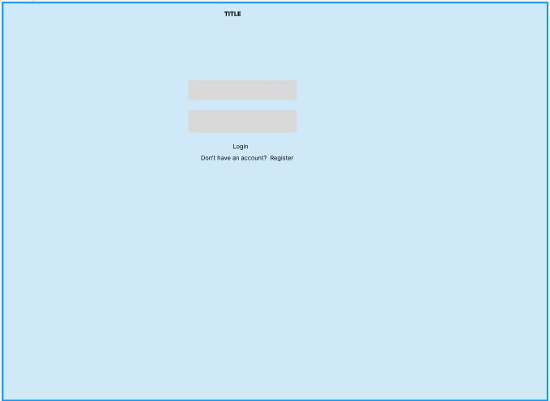
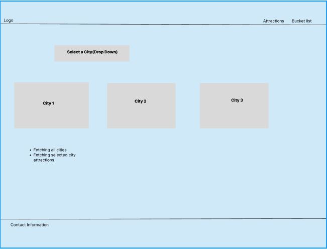
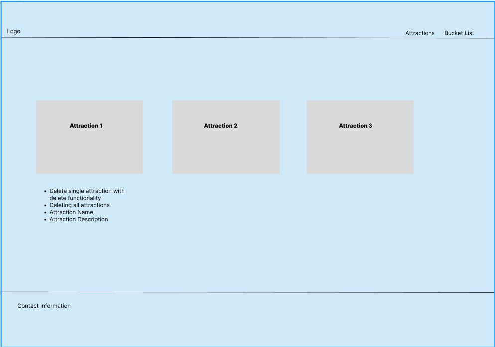

# Project Title

## Overview

The purpose of this project was to create a website for travel enthusiasts. The original intent was to let users search for destinations, select cities & add attractions to their bucket list. Additionally, users would have the option to sign up and remove attractions from their lists.

### Problem

Many of us spend hours scrolling through social media platforms like TikTok or Instagram, liking and saving numerous videos without ever returning to them. We come across countless unique sightseeing spots, but there's no single platform to gather and showcase these findings for future reference. That's why we're building a website where people can share their favorite places with each other.

### Features

- As a user, I want to be able to create an account to manage my visited places
- As a user, I want to be able to login to my account to manage my visited places

- As a logged in user, I want to be able to add to todo list
- As a logged in user, I want to be able to see my visited attractions
- As a logged in user, I want to be able to select place to get all attractions for that selected place

## Implementation

### Tech Stack

- React
- SASS
- MySQL
- Express
- Client libraries: 
    - react
    - react-router
    - axios
- Server libraries:
    - knex
    - express
    - bcrypt for password hashing

### APIs

- No external APIs will be used for the sprint

### Sitemap

- Home 
- Register
- Login
- Attractions
- To do List

### Mockups

#### Register Page

#### Login Page

#### Attractions Page

#### To do list Page

## Roadmap

- Create client
    - react project with routes and boilerplate pages

- Create server
    - express project with routing

- Create migrations

- Gather 15 sample cities/ countries

- Create seeds with sample attractions data

- Bug fixes

- DEMO DAY

